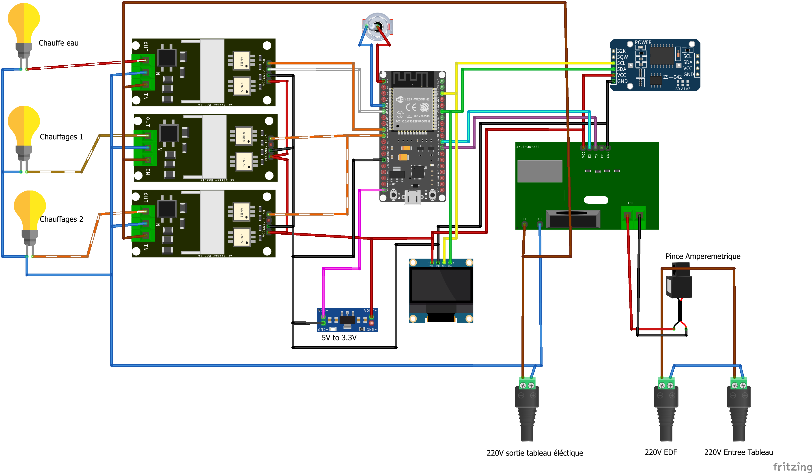
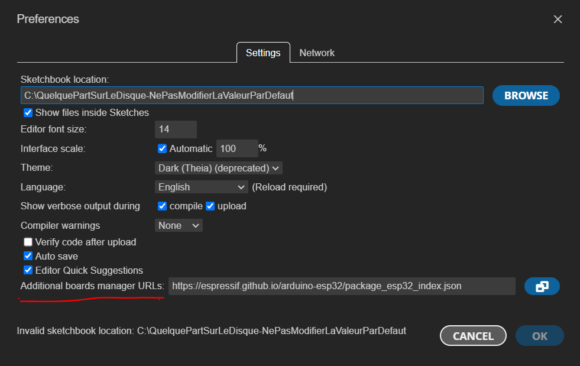
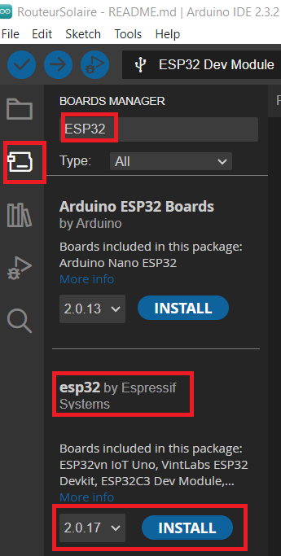
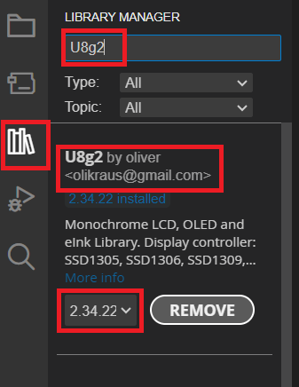
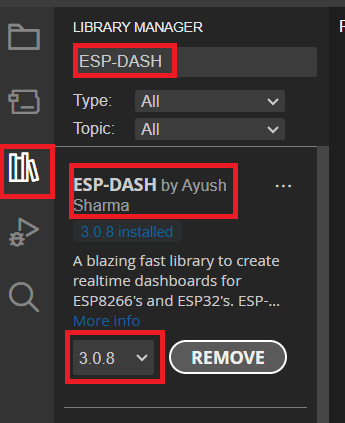
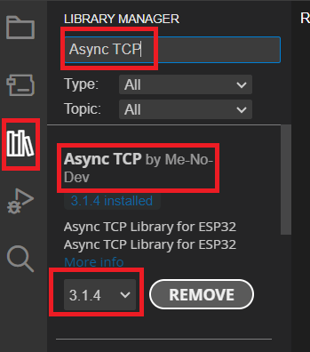
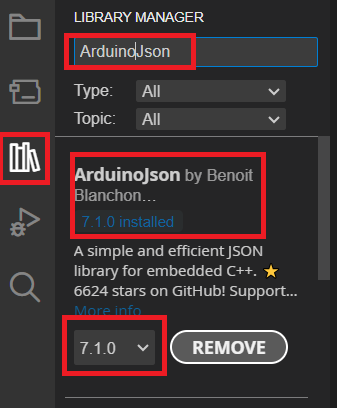

# Routeur Solaire

d'après https://sites.google.com/view/le-professolaire/routeur-professolaire

avec la version Profes'Solaire v9.15 - 28-11-2023 - professolaire@gmail.com

## Description
- à base de ESP32 en utilisant les 2 coeurs du CPU
- contrôle 2 dimmers (on peut mettre plusieurs dimmers en parallèle sur chaque sortie si besoin)
- pas besoin de box WiFi pour le fonctionnement
- affichage des informations sur un petit écran
- possibilité de connexion sur le WiFi du ESP32 pour avoir une interface Web
- mise à jour OTA en WiFi

## Materiel

- Carte de développement [ESP32 DevKit C](https://docs.espressif.com/projects/esp-idf/en/v5.3/esp32/hw-reference/esp32/get-started-devkitc.html#get-started-esp32-devkitc-board-front) avec un ESP32-WROOM-32
    - en vente sur eBay par exemple [ESP32 WiFi Bluetooth Development Board CP2102 / ESP32 Breakout Expansion Board](https://www.ebay.com/itm/175889496895?var=475304448650), la carte d'extension facilite le montage
    - en vente aussi sur Amazon par exemple [AZDelivery ESP32 NodeMCU Module WLAN WiFi Dev Kit C Development Board avec CP2102](https://www.amazon.fr/dp/B071P98VTG) ou sur le site [www.az-delivery.de](https://www.az-delivery.de/fr/products/esp32-developmentboard)
    - plusieurs schémas de la carte existent:
        - chez Espressif : [ESP32 DevKitC v2 schematic](https://dl.espressif.com/dl/schematics/ESP32-Core-Board-V2_sch.pdf) et une copie ici [ESP32 DevKitC v2 schematic-copy](techdata/esp32/ESP32-Core-Board-V2_sch.pdf)
        - chez AzDelivery et une copie ici [ESP32-azdelivery-copy.pdf](techdata/esp32/ESP-32_NodeMCU_Developmentboard_Schematic_korr.pdf)
    - pour les PINs:
    
        - surtout ne rien connecter sur les pins CMD/SD3/SD2 et CLK/SD0/SD1
        - **Attention à coté du 5V le pin est CMD et non pas ground.** Sur certains diagrammes ou kits on peut lire GND. Il ne faut surtout pas y brancher quelque chose.
        - cette page décrit bien les choses [UPesy ESP32 Pinout](https://www.upesy.fr/blogs/tutorials/esp32-pinout-reference-gpio-pins-ultimate-guide)
- 2 sorties pour **dimmer avec triacs Robodyn** à l'origine 16A / 3000 watts:
    - [Robodyn Module variateur pour 16/24A - fr](https://robotdyn.com/fr/module-variateur-pour-16-24a-600v-haute-charge-1-canal-logique-3-3v-5v/), dont la documentation Anglaise est plus détaillée : [Robodyn Dimmer module for 16/24A - en](https://robotdyn.com/dimmer-module-for-16-24a-600v-high-load-1-channel-3-3v-5v-logic.html)
    - en vente sur [Aliexpress - Dimmer AC module for 16A/24A/8A 400-600V High Load, 1 Channel, 3.3V/5V logic](https://www.aliexpress.com/item/1005001965951718.html)
    - lui apporter des modification: mettre un radiateur plus grand, mettre un triac déporté plus grand
- capteur de courant **JSY-MK-194T** du fabricant [Shenzhen Jiansiyan Technologies Co., Ltd.](https://www.jsypowermeter.com/)
    - téléchargement de la documentation sur leur site [Downloads JSY_MK](https://www.jsypowermeter.com/download/), en particulier
      - [JSY-MK-194T(1 Onboard 1 Open CT) User Manual copie](techdata/amperemetre_JSY-MK-194t/JSY-MK-194T1-Onboard-1-Open-CT-User-Manual.pdf)
      - [Logiciel de test et programmation JSY-MK-194T copie](techdata/amperemetre_JSY-MK-194t/JSY-MK-194T-test-software1.rar)
    - en vente par le fabricant sur Aliexpress
        - en version 1 pince externe:
            - [Aliexpress JSY-MK-194T ref 1](https://fr.aliexpress.com/item/4000382671357.html)
            - [Aliexpress JSY-MK-194T ref 2](https://fr.aliexpress.com/item/4000382480848.html)
        - en version 2 pinces externes [Aliexpress JSY-MK-194T deux pinces ref 3](https://fr.aliexpress.com/item/1005005529999366.html)
- écran [OLED SSD1306 128x64 I2C](https://passionelectronique.fr/ecran-oled-i2c-arduino/):
   - disponible chez de nombreux vendeurs par exemple [recherche OLED SSD1306 128x64 I2C sur eBay.com](https://www.ebay.com/sch/i.html?_from=R40&_nkw=OLED+SSD1306+128x64+I2C&_sacat=0), [recherche OLED SSD1306 128x64 I2C sur Amazon](https://www.amazon.fr/s?k=OLED+SSD1306+128x64+I2C)
   - ou bien chez des vendeurs en ligne comme [AzDelivery OLED SSD1306 128x64 I2C](https://www.az-delivery.de/fr/products/0-96zolldisplay)
- [régulateur 5V vers 3.3V (optionnel)](https://amzn.eu/d/0WqawvL)
- [module RTC DS3231 (optionnel à venir)](https://passionelectronique.fr/tutorial-ds3231/)

## Montage

 * JSY-MK-194 pins (16 vers RX et 17 vers TX)
 * Dimmer1 (35 ZC/ZeroCross et 25 PSM/Pulse)
 * Dimmer 2 24A-600V (26 PSM/Pulse)
 * écran Oled (22 : SCK et 21 SDA)

## Configuration Arduino IDE

J'utilise [Arduino IDE 2.3.2](https://www.arduino.cc/en/software) (téléchargement [arduino-ide_2.3.2_Windows_64bit.msi](https://downloads.arduino.cc/arduino-ide/arduino-ide_2.3.2_Windows_64bit.msi)).

### Installation de la plateforme ESP32

Dans le menu `File>Preferences...` ajouter dans `Additional boards manager URLs` la valeur: `https://espressif.github.io/arduino-esp32/package_esp32_index.json`.


Une fois le téléchargement des définitions faits par ArduinoiDE on peut passer à l'installation des packages.

Dans `Boards Manager` installer `esp32 by Espressif` version `2.0.17` (chercher IDE).


### Installation des libraries
#### Depuis l'IDE

Dans `Libraries Manager` installer (captures d'écran faites aprés l'installation):

* U8g2 by oliver version 2.34.22


* ESP-DASH by Ayush version 3.0.8



* Async TCP by Me-No-Dev version 3.1.4



* ArduinoJson by Benoit Blanchon version 7.1.0



#### Avec GIT

Avec GIT installer les lib suivantes:

* RBDdimmer version 1.1 https://github.com/flav1972/RBDDimmer. C'est une version modifiée de la lib originelle https://github.com/RobotDynOfficial/RBDDimmer afin de permetre l'utilisation au maximum de puissance du dimmer. (La version originale produit des clignotements à partir de 95%).
```
cd _Modifier_le_debut_\Documents\Arduino\libraries
git clone https://github.com/flav1972/RBDDimmer.git
cd RBDDimmer
git checkout 1.1
``` 


* ESP Async WebServer by me-no-dev version 2.1.4 depuis git https://github.com/flav1972/ESPAsyncWebServer.git (copie de https://github.com/me-no-dev/ESPAsyncWebServer commit 7f3753454b1f176c4b6d6bcd1587a135d95ca63c)
```
cd _Modifier_le_debut_\Documents\Arduino\libraries
git clone https://github.com/flav1972/ESPAsyncWebServer.git
cd ESPAsyncWebServer
git checkout 2.1.4
```
## Choix de la carte sur l'IDE
Dans `Tools>Board` sélectionner `esp32>ESP32 Dev Module`

## Avant la première utilisation
Avant la première utilisation du montage uploader https://github.com/flav1972/RouteurVerif sur l'ESP32 afin de vérifier que le montage est bien fait et de parametrer le JSY-MKT-194T.

## Paramétrage du code

### Pour utiliser le WiFi d'une box
Créer un fichier `wifi_config.h` sur l'exemple de [wifi_config.example.h](./wifi_config.example.h).

Sans la présence de ce fichier l'ESP32 ne va pas essayer de se connecter à une box

## Désactiver le mode simulation
Dans le fichier `RouteurSolaire.ino` autour de la ligne 37 commenter `#define CoefSimulation 60.0` ainsi:
```C++
// Coefficient pour simuler des charges reeles avec des petites charges
//#define CoefSimulation 60.0

#ifndef CoefSimulation
#define CoefSimulation 1.0
#endif
```

Lorsque le mode simulation est actif, les calculs et affichages sont faits avec un multiplicateur des valeurs Courant et Puissance de la valeur du `CoefSimulation`. Ceci permet un test du code et du montage sur un plateau de laboratoire.

# Compléments
## TODO
* forçage du premier dimmer à 100%
* utilisation d'un module RTC pour remettre à zéro la somme des énergies

## Versions des libraries utilisées remontées par le build

- RBDdimmer-flav version 1.1 in folder: SomeUser\Documents\Arduino\libraries\RBDDimmer 
- U8g2 version 2.34.22 in folder: SomeUser\Documents\Arduino\libraries\U8g2 
- Wire version 2.0.0 in folder: SomeUser\AppData\Local\Arduino15\packages\esp32\hardware\esp32\2.0.17\libraries\Wire 
- WiFi version 2.0.0 in folder: SomeUser\AppData\Local\Arduino15\packages\esp32\hardware\esp32\2.0.17\libraries\WiFi 
- ESP-DASH version 3.0.8 in folder: SomeUser\Documents\Arduino\libraries\ESP-DASH 
- Async TCP version 3.1.4 in folder: SomeUser\Documents\Arduino\libraries\Async_TCP 
- ESP Async WebServer version 1.2.4 in folder: SomeUser\Documents\Arduino\libraries\ESPAsyncWebServer 
- FS version 2.0.0 in folder: SomeUser\AppData\Local\Arduino15\packages\esp32\hardware\esp32\2.0.17\libraries\FS 
- ArduinoJson version 7.1.0 in folder: SomeUser\Documents\Arduino\libraries\ArduinoJson 
- ArduinoOTA version 2.0.0 in folder: SomeUser\AppData\Local\Arduino15\packages\esp32\hardware\esp32\2.0.17\libraries\ArduinoOTA 
- Update version 2.0.0 in folder: SomeUser\AppData\Local\Arduino15\packages\esp32\hardware\esp32\2.0.17\libraries\Update 
- DNSServer version 2.0.0 in folder: SomeUser\AppData\Local\Arduino15\packages\esp32\hardware\esp32\2.0.17\libraries\DNSServer 
- SPI version 2.0.0 in folder: SomeUser\AppData\Local\Arduino15\packages\esp32\hardware\esp32\2.0.17\libraries\SPI 
- ESPmDNS version 2.0.0 in folder: SomeUser\AppData\Local\Arduino15\packages\esp32\hardware\esp32\2.0.17\libraries\ESPmDNS 